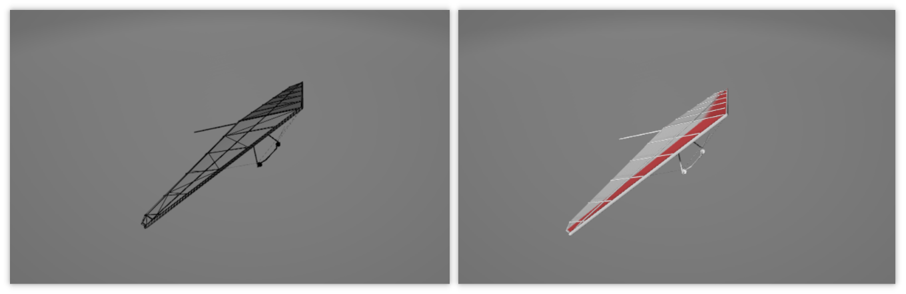
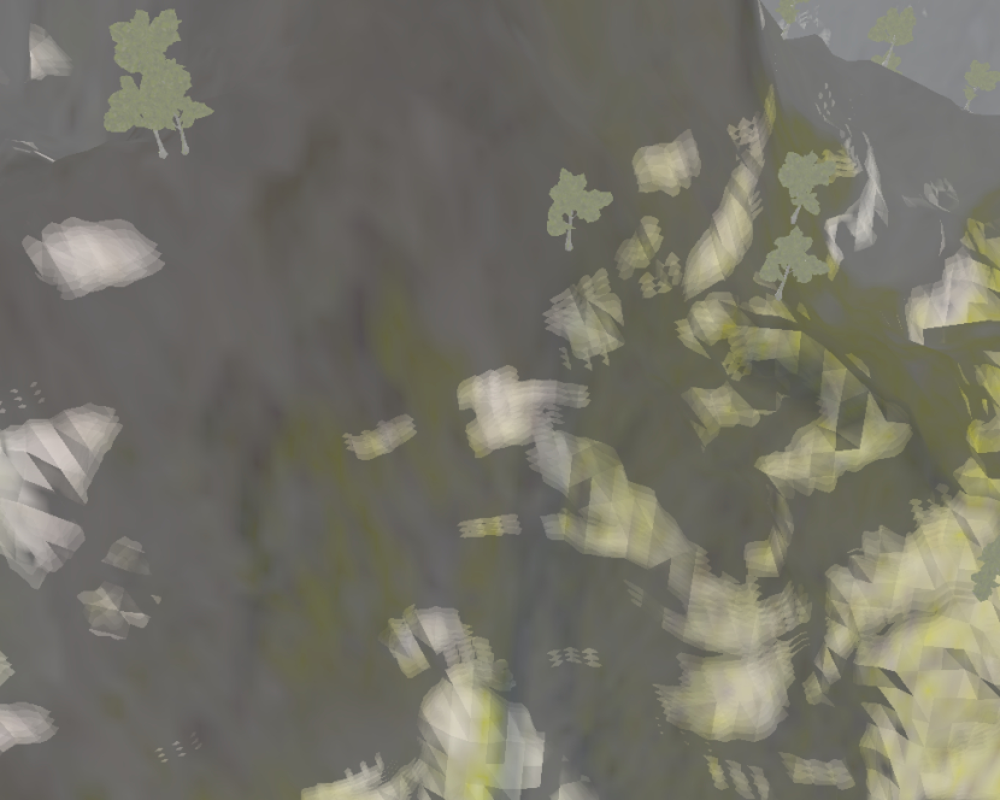
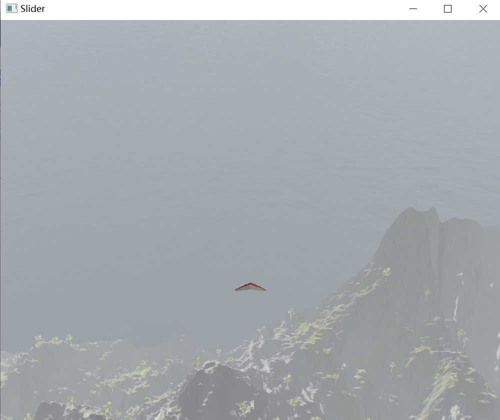

<center>
<font size = 6><b>FLYING GLIDER</b>
</font>
</br>
</br>
<font size = 4>刘瑞同(3180102934)&nbsp;&nbsp;&nbsp;朱雨轩(3180105150)&nbsp;&nbsp;&nbsp;陆飞洋(3180103184)</font>
</center>


[TOC]

# 一、项目简介

​		本次project实现了一个控制滑翔翼在山间漫游的小游戏，玩家通过WSAD以及鼠标的滚轮可以控制滑翔翼飞行的方向并实现视角远近的切换，在欣赏山间风景的同时保持滑翔翼不会碰撞到山上。

​		参考 [LearnOpenGL  中文教程](https://learnopengl-cn.github.io/)完成该大作业。

​		**<u>==高亮==部分为展示课后新增内容。</u>**

## 1.1 使用方式

#### **键盘控制**

| 按键 | 效果           |
| ---- | -------------- |
| w    | 滑翔翼向上攀飞 |
| s    | 滑翔翼向下俯冲 |
| a    | 滑翔翼向左盘旋 |
| d    | 滑翔翼向右盘旋 |

#### 鼠标控制

| 按键     | 效果               |
| -------- | ------------------ |
| 滚轮向前 | 拉近效果，视角变窄 |
| 滚轮向后 | 拉远效果，视角变宽 |

## 1.2 完成要求

#### 基本要求

1. 基于OpenGL实现，具有基本的三角形，三棱锥等体素的绘制

2. 具有OBJ导入导出功能(如树木、滑翔翼)，通过Blender进行建模

3. 具有基本材质、纹理和编辑能力。山体、滑翔翼、树等物品的材质均能正常显示，并通过改变对应的材质可以对表面进行更迭。

4. 具有基本的集合变换功能，主要体现在三角翼的控制、视角切换、相机跟随等方面。

5. 使用Blinn-Phong光照模型，并设定平行光照射，只要改变对应的参数(如光源位置、光照强度等)就可以实现基本光源的编辑。

6. 能控制滑翔翼在场景中进行漫游，zoom In/Out调整视角远近，旋转、变向等待。

#### Awesome功能

1. 实现了雾化的效果，使得整个场景更加美化。

2. ==在展示后新增加了下雪的粒子特效，但是这个版本我们只能在使用了英伟达显卡的电脑上运行，在普通的笔记本上无法运行。==

3. 不仅使用了漫反射、环境光贴图，在渲染山体的时候，我们还加入了法向贴图和移位贴图，从另一个层面上增加了山体的细节。

4. 使用了Gamma校正和HDR的技术，使得整个场景的光照更加清晰与真实。

#### 额外要求

1. 滑翔翼漫游的时候可以实时与山体进行碰撞检测

2. 通过shadow map实现实时阴影效果，并使用了移位贴图、法向贴图增加山体细节信息。为了使得阴影更加平滑，使用了PCF的方法对阴影进行了平滑处理。

# 二、渲染流程

## 2.1 流程图


## 2.2 伪代码

```c
int main(){
	// 初始化glfw与glad相关参数、创建上下文、创建窗口
	initAll();

	// 注册鼠标、滚轮、键盘回调函数
	registerCallbackFunction();

	// 初始化游戏参数
	myGame.init();

	// 渲染主循环,当收到窗口关闭信号的时候终止循环
	while(!glfwWindowShouldClose(window))
	{
		// 计算前一帧与当前帧相隔时间
		dt = currentFrame - lastFrame;

		// 响应键盘鼠标输入
		myGame.ProcessInput();

		// 如果还没撞机坠毁
		if(！myGame.isCrash){
			//更新游戏参数
			myGame.Update(dt);
			//渲染图像
			myGame.Render();
		}
		// 如果已经撞机坠毁
		else{
			myGame.UpdateAfterCrash(dt);
			myGame.RenderAfterCrash();
		}

		// 交换缓冲区
		glfwSwapBuffers(window);
	}
}
```

# 三、文件说明

## 3.1 include目录（有雪花版本）


1. GL/glad/KHR/GLFW：均为OpenGL相关的文件，本次实验主要使用了glfw进行开发

2. assimp：模型加载辅助库

3. glm：向量矩阵运算库

4. stb_image.h：图片加载库

## 3.2 主目录下文件及其功能


1. main.cpp：主程序入口

2. game.cpp/game.h：游戏类，该类用于存储游戏基本信息以及响应的操作函数

3. groundrender.h/groundrender.cpp：地形渲染类，用于存储地形相关参数以及函数

4. groundgrass.fs/groundgradd.vs：山地渲染顶点着色器和片元着色器

5. groundInstance.fs/groundInstance.vs：树渲染的顶点和片元着色器

6. modelrender.cpp/modelrender.h：模型类，用于滑翔翼模型的绘制

7. modelloading.fs/modelloading.vs：模型渲染顶点和片元着色器(弃)

8. glider.fs/glider.vs：模型渲染顶点和片元着色器

9. shadowmaprender.cpp/shadowmaprender.h：shadowmap类

10. shadowmap.fs/shadowmap.vs：生成shadowmap的片元着色器和顶点着色器

11. debug_quad.vs/debug_quad_depth.fs：用于shadowMap可视化绘制的顶点着色器和片元着色器

12. flamerender.cpp/flamerender.h：用于生成撞击后产生火焰粒子效果的类，但是未实现

13. flameloading.fs/flameloading.gs/flameloading.vs：用于绘制火焰粒子特效的顶点、几何、片元着色器，但是未实现

14. skyboxrender.cpp/skyboxrender.h：天空盒类

15. skybox.fs/skybox.vs：天空盒绘制顶点片元着色器

16. Fog.cpp/Fog.h/Fog.glsl：用于雾生成的类

17. snow文件夹：雪花绘制相关类、着色器

18. mesh.cpp/mesh.h/model.cpp/model.h：模型加载类，参照learnopengl一书实现

19. camera.cpp/camera.h：相机变换类，参照learnopengl一书实现

20. glad.c：glad库文件

21. resource_manager.cpp/resource_manager.h资源管理类

22. shader.cpp/shader.h：着色器加载类，参照learnopengl一书实现

23. texture.cpp/texture.h：纹理加载类，参照learnopengl一书实现

24. stb_image.cpp：stb_image库预加载头文件

除此之外的一些文件可能是我们写程序的时候使用的但后来弃用的文件，没有引入不具有相关功能。

## 3.3 resources资源目录

<u>该目录下存放在我们所用的各种纹理以及obj模型</u>


# 四、实现原理

## 4.1 地形的生成

​		如下所示，我们将平面(下图只是个例子，初始是在平面上划分的)划分为等大的小三角形来拟合地形网格


​		为了使得地形能够起伏，我们从网络上下载了一张高度图。根据小三角形的坐标，除以一个值均匀映射到[0,1]，然后从高度图的相应坐标取灰度值作为该点的地势，对应的高度图如下所示。灰度值越大代表地势越高，反之代表地势越低。


​		为了增加山地的细节，我们首先对其添加材质纹理，如下所示我们使用了漫反射和环境光两张贴图，而镜面反射和shines的值我们取成了一个固定的值。


​		接着为了更进一步地增加细节信息我们使用了法线贴图和移位贴图，他们可以增加物体表面地凹凸感，从另一个维度上丰富山体信息。


​		法线贴图中的法线向量定义在切线空间中，切线空间中的法线一直指向正z轴，为了使用法线贴图我需要计算出TBN空间中的T值和B值，根据《learnopengl》书中给出的例子，对于一个给定的三角形我们可以通过如下的方法对其进行手工转换。

```c++
//positions
glm::vec3 pos1(nowX, nownowz, nowY);
glm::vec3 pos2(nextX, nownextz, nowY);
glm::vec3 pos3(nextX, nextnextz, nextY);
glm::vec3 pos4(nowX, nextnowz, nextY);
//texture coordinates
glm::vec2 uv1(nowX * textureScale, nowY * textureScale);
glm::vec2 uv2(nextX * textureScale, nowY * textureScale);
glm::vec2 uv3(nextX * textureScale, nextY * textureScale);
glm::vec2 uv4(nowX * textureScale, nextY * textureScale);
//normal vector
glm::vec3 nm(0.0f,0.0f,1.0f);
//calculate tagent/bitagent vectors of both triangles
glm::vec3 tangent1, bitangent1;
glm::vec3 tangent2, bitangent2;

//-----------------------triangle 1-----------------------
glm::vec3 edge1 = pos2 - pos1;
glm::vec3 edge2 = pos3 - pos1;
glm::vec2 deltaUV1 = uv2 - uv1;
glm::vec2 deltaUV2 = uv3 - uv1;

float f = 1.0f / (deltaUV1.x * deltaUV2.y - deltaUV2.x * deltaUV1.y);

tangent1.x = f * (deltaUV2.y * edge1.x - deltaUV1.y * edge2.x);
tangent1.y = f * (deltaUV2.y * edge1.y - deltaUV1.y * edge2.y);
tangent1.z = f * (deltaUV2.y * edge1.z - deltaUV1.y * edge2.z);

bitangent1.x = f * (-deltaUV2.x * edge1.x + deltaUV1.x * edge2.x);
bitangent1.y = f * (-deltaUV2.x * edge1.y + deltaUV1.x * edge2.y);
bitangent1.z = f * (-deltaUV2.x * edge1.z + deltaUV1.x * edge2.z);

//-----------------------triangle 2-----------------------
edge1 = pos3 - pos1;
edge2 = pos4 - pos1;
deltaUV1 = uv3 - uv1;
deltaUV2 = uv4 - uv1;

f = 1.0f / (deltaUV1.x * deltaUV2.y - deltaUV2.x * deltaUV1.y);

tangent2.x = f * (deltaUV2.y * edge1.x - deltaUV1.y * edge2.x);
tangent2.y = f * (deltaUV2.y * edge1.y - deltaUV1.y * edge2.y);
tangent2.z = f * (deltaUV2.y * edge1.z - deltaUV1.y * edge2.z);

bitangent2.x = f * (-deltaUV2.x * edge1.x + deltaUV1.x * edge2.x);
bitangent2.y = f * (-deltaUV2.x * edge1.y + deltaUV1.x * edge2.y);
bitangent2.z = f * (-deltaUV2.x * edge1.z + deltaUV1.x * edge2.z);
```

​		为了提高性能，我们可以用TBN矩阵的逆矩阵将所有相关的世界空间向量转变到采样所得法线向量的空间，这么做由于顶点着色器通常比像素着色器运行的像素点少，我么们可以减少运算的次数。对应的顶点着色器相关代码如下所示

```c++
mat3 normalMatrix = transpose(inverse(mat3(model)));
vec3 T = normalize(normalMatrix * aTangent);
vec3 N = normalize(normalMatrix * aNormal);
T = normalize(T - dot(T, N) * N);
vec3 B = cross(N, T);

mat3 TBN = transpose(mat3(T, B, N));    
TangentLightPos = TBN * (FragPos+light.direction);
TangentViewPos  = TBN * viewPos;
TangentFragPos  = TBN * FragPos;
```

​		而移位贴图只需要计算位移量即$\text{scalesize} * \text{displacement} * \text{normal}$ 

​		只需要修改顶点着色器中的每个插值点的位置即可实现，对应的代码如下所示：

```c
float scaleSize = 0.1;
vec3 disnormal = texture(material.normal, TexCoords).rgb;
disnormal = normalize(disnormal * 2.0 - 1.0);
disnormal = mat3(T, B, N) * disnormal;
 vec3 disPos = aPos + scaleSize * texture(material.displacement, TexCoords).r * disnormal;
```

​		最终我们的山效果如下所示：


## 4.2 树的生成

​		我们的树是通过blender进行简单的建模，对应的坐标点和材质分别保存在一个obj和一个mtl中。


#### 实例化技术

​		大量树木的绘制不能简单地使用一个for循环，这样会使得电脑跟不上渲染地性能。为OpenGL在绘制顶点数据之前需要做很多准备工作（比如告诉GPU该从哪个缓冲读取数据，从哪寻找顶点属性，而且这些都是在相对缓慢的CPU到GPU总线(CPU to GPU Bus)上进行的）。所以，即便渲染顶点非常快，命令GPU去渲染却未必。

​		因而我们采用<u>**实例化**</u>的技术(Instancing)来解决这个问题，其基本思想是将数据一次性发送给GPU，然后使用一个绘制函数让OpenGL利用这些数据绘制多个物体，这样就避免了重复的准备工作。 

​		glfw中只需要进行一些基本的预操作，并使用glDrawArraysInstanced和glDrawElementsInstanced这类函数即可实现	

```c
for (unsigned int i = 0; i < treeModel.meshes.size()-1; i++)
	{
		glActiveTexture(GL_TEXTURE0);
		glBindTexture(GL_TEXTURE_2D, treeModel.textures_loaded[i].id);
		glBindVertexArray(treeModel.meshes[i].VAO);
		glDrawElementsInstanced(GL_TRIANGLES, treeModel.meshes[i].indices.size(), GL_UNSIGNED_INT, 0, amount);
		glBindVertexArray(0);
	}
```

​		最终我们可以更高性能绘制更多树木，这边的绿点点就是远看的树。


## 4.3 光照模型

​		这里我们采用了Blinn-Phong的光照模型，并采取了平行光照射的方式进行光照的模拟。

​		Blinn-Phong模型与冯氏模型非常相似，但是它对镜面光模型的处理上有一些不同，它不再依赖于反射向量，而是采用了所谓的半程向量(Halfway Vector)，即光线与视线夹角一半方向上的一个单位向量。当半程向量与法线向量越接近时，镜面光分量就越大。这样，不论观察者向哪个方向看，半程向量与表面法线之间的夹角都不会超过90度，从而产生更加自然的光线效果。


​		基本的计算方式与Phong模型相似，依次计算环境光、漫反射、镜面反射的值，只不过在计算镜面反射的时候采用的是半程向量。下面是groundgrass.fs中相关部分的计算代码，其他着色器原理相同。

```c
// ambient
vec3 ambient = 0.08 * light.ambient * texture(material.ambient, TexCoords).rgb;
  	
// diffuse 
vec3 norm = texture(material.normal, TexCoords).rgb;
norm = normalize(norm * 2.0 - 1.0);

vec3 lightDir = normalize(TangentLightPos - TangentFragPos);
float diff = max(dot(norm, lightDir), 0.0);
vec3 diffuse = light.diffuse * diff * texture(material.diffuse, TexCoords).rgb;  
    
// specular
vec3 viewDir = normalize(TangentViewPos - TangentFragPos);
vec3 halfwayDir = normalize(lightDir + viewDir);
float spec = pow(max(dot(norm, halfwayDir), 0.0), material.shininess);
vec3 specular = light.specular * (spec * vec3(0.2f, 0.2f, 0.2f));  
```

​		最终实现的效果如下所示：

 * 向光面的山景：

    

* 背光面的山景：

    

## 4.4 阴影的实现

#### （1）Shadow Mapping

​		为了实现阴影效果，我们使用了传统的方法阴影映射，即我们以光的位置为视角进行渲染，我们能看到的东西都将被点亮，看不见的一定是在阴影之中了。对此我们需要使用帧缓冲的技术，使用帧缓冲并绑定纹理格式为深度纹理即可，对应的生成方式比较的形式话，主要是生成一张深度纹理用于保存深度信息：

```c
ShadowMapRender::ShadowMapRender(Shader shader, glm::vec3 lightPos, unsigned int SHADOW_WIDTH, unsigned int SHADOW_HEIGHT) {
	 this->shader = shader;
    this->lightPos = lightPos;
    lightProjection = glm::ortho(-7.0f, 9.0f, -10.0f, -2.0f, 1.0f, 20.0f);
    lightView = glm::lookAt(lightPos, glm::vec3(0.0f,0.0f,0.0f), glm::vec3(0.0, 1.0, 0.0));
    lightSpaceMatrix = lightProjection * lightView;

	 glGenFramebuffers(1, &(depthMapFBO));
    glGenTextures(1, &(depthMap));
    glBindTexture(GL_TEXTURE_2D, depthMap);
    glTexImage2D(GL_TEXTURE_2D, 0, GL_DEPTH_COMPONENT, SHADOW_WIDTH, SHADOW_HEIGHT, 0, GL_DEPTH_COMPONENT, GL_FLOAT, NULL);
    glTexParameteri(GL_TEXTURE_2D, GL_TEXTURE_MIN_FILTER, GL_NEAREST);
    glTexParameteri(GL_TEXTURE_2D, GL_TEXTURE_MAG_FILTER, GL_NEAREST);
    glTexParameteri(GL_TEXTURE_2D, GL_TEXTURE_WRAP_S, GL_CLAMP_TO_BORDER);
    glTexParameteri(GL_TEXTURE_2D, GL_TEXTURE_WRAP_T, GL_CLAMP_TO_BORDER);
    float borderColor[] = { 1.0, 1.0, 1.0, 1.0 };
    glTexParameterfv(GL_TEXTURE_2D, GL_TEXTURE_BORDER_COLOR, borderColor);
    glBindFramebuffer(GL_FRAMEBUFFER, depthMapFBO);
    glFramebufferTexture2D(GL_FRAMEBUFFER, GL_DEPTH_ATTACHMENT, GL_TEXTURE_2D, depthMap, 0);
    glDrawBuffer(GL_NONE);
    glReadBuffer(GL_NONE);
    glBindFramebuffer(GL_FRAMEBUFFER, 0);
}
```

​		着色器部分我们不需要绘制任何颜色，只是把深度写入绑定的纹理中，由此形成一张深度贴图。这里需要注意的是我们传入了一个视角变换矩阵，将视角变换到光的位置。

​		还有一点就是我们的地形是普通绘制的，而树是实例化绘制的，实例化绘制的树有一个实例化转换矩阵，它不同于model矩阵，因此我们需要传入一个变量用于判断当前物体是不是实例化物体。

* 顶点着色器：

    ```c
    #version 330 core
    layout (location = 0) in vec3 aPos;
    layout (location = 3) in mat4 aInstanceMatrix;
    
    uniform mat4 lightSpaceMatrix;
    uniform mat4 model;
    uniform bool isInstance;
    
    void main()
    {
    	if(isInstance)
    		gl_Position = lightSpaceMatrix * aInstanceMatrix * vec4(aPos, 1.0);
    	else
        	gl_Position = lightSpaceMatrix * model * vec4(aPos, 1.0);
    }
    ```

* 片元着色器：

    ```c
    #version 330 core
    
    void main()
    {             
        // gl_FragDepth = gl_FragCoord.z;
    }
    ```

#### （2）深度贴图可视化

​		为了能够debug生成的深度图是否正确，我们新写了两个着色器debug_quad.vs和debug_quad_depth.fs，他们会根据深度贴图中的远近可视化地展示出这张深度贴图，其中越远越白，越近越黑

```c
#version 330 core
out vec4 FragColor;

in vec2 TexCoords;

uniform sampler2D depthMap;
uniform float near_plane;
uniform float far_plane;

// required when using a perspective projection matrix
float LinearizeDepth(float depth)
{
    float z = depth * 2.0 - 1.0; // Back to NDC 
    return (2.0 * near_plane * far_plane) / (far_plane + near_plane - z * (far_plane - near_plane));	
}

void main()
{             
    float depthValue = texture(depthMap, TexCoords).r;
    // FragColor = vec4(vec3(LinearizeDepth(depthValue) / far_plane), 1.0); // perspective
    FragColor = vec4(vec3(depthValue), 1.0); // orthographic
}
```

```c
#version 330 core
layout (location = 0) in vec3 aPos;
layout (location = 1) in vec2 aTexCoords;

out vec2 TexCoords;

void main()
{
    TexCoords = aTexCoords;
    gl_Position = vec4(aPos, 1.0);
}
```

​		光源视角下我们的深度贴图可视化后的结果如下所示，可以看到山的基本轮廓和星星点点的树。


#### （3）深度贴图应用及阴影失真

​		有了深度贴图之后我们便可以将它当作一个纹理传入着色器。我们只要将当前点转换为光坐标系下的位置，并将当前值与深度贴图中的值进行比较，若两者相等则说明该点可见，若大于则说明不可见。

​		但是这有一个问题，就是由于存储精度的问题会导致比较会产生偏差从而产生阴影失真的效果。为了解决这个问题，我们需要手动去设置一个bias作为容许范围，如下所示我这里设置的bias为0.0001到0.0002的一个值

```c
float ShadowCalculation(vec4 fragPosLightSpace)
{
  // perform perspective divide
    vec3 projCoords = fragPosLightSpace.xyz / fragPosLightSpace.w;
    // transform to [0,1] range
    projCoords = projCoords * 0.5 + 0.5;
    // get closest depth value from light's perspective (using [0,1] range fragPosLight as coords)
    float closestDepth = texture(shadowMap, projCoords.xy).r; 
    // get depth of current fragment from light's perspective
    float currentDepth = projCoords.z;
    // calculate bias (based on depth map resolution and slope)
    vec3 normal = normalize(Normal);
    vec3 lightDir = normalize(light.lightPos - FragPos);
    float bias = max(0.04 * (1.0 - dot(normal, lightDir)), 0.01);
    // check whether current frag pos is in shadow
    // float shadow = currentDepth - bias > closestDepth  ? 1.0 : 0.0;
    // PCF
    float shadow = 0.0;
    vec2 texelSize = 1.0 / textureSize(shadowMap, 0);
    for(int x = -1; x <= 1; ++x)
    {
        for(int y = -1; y <= 1; ++y)
        {
            float pcfDepth = texture(shadowMap, projCoords.xy + vec2(x, y) * texelSize).r; 
            shadow += currentDepth - bias > pcfDepth  ? 1.0 : 0.0;        
        }    
    }
    shadow /= 9.0;
    
    // keep the shadow at 0.0 when outside the far_plane region of the light's frustum.
    if(projCoords.z > 1.0)
        shadow = 0.0;
    //return 0.0;
    return shadow;
}
```

#### （4）PCF（percentage-closer filtering）

​		采用shadow mapping方法，当我们放大阴影的时候会看到边缘明显的锯齿形状，如下所示。这是因为深度贴图有一个固定的分辨率，多个片段对应于一个纹理像素。结果就是多个片段会从深度贴图的同一个深度值进行采样，这几个片段便得到的是同一个阴影，这就会产生锯齿边。

​		一个解决办法是从深度贴图中多次采样，每一次采样的纹理坐标都稍有不同。每个独立的样本可能在也可能不再阴影中。所有的次生结果接着结合在一起，进行平均化，我们就得到了柔和阴影。就相当于一个滤波器的感觉，对整个图形进行平滑处理


​		最终生成的阴影效果如下所示，可以很明显地看到树和山的阴影


## 4.5 滑翔翼

​		用blender软件建立一个简单的三角翼三维模型并贴图，如下：	



#### （1） 模型加载

​		Assimp 库支持三维模型以.obj格式导入和导出，当使用它导入一个模型的时候，会将整个模型加载进一个Scene对象，它会包含导入的模型所有数据，以Assimp库自己定义的数据结构存储，我需要做的是把需要的网格、材质等数据从中解析出来。Assimp库的数据结构如下：


​		Scene的mMeshes储存了真正的Mesh对象，节点中的mMeshes数组保存的只是Scene中网格数组mMeshes的索引。Mesh类包含了渲染所需要的所有数据，如顶点位置、法向量、纹理坐标、面和材质。Material类包含物体的材质属性，如颜色和纹理贴图。根据此数据结构，我们解析逻辑如下：

1. 从根节点Root node开始，递归遍历结构树寻找子节点。
2. 对于每一个子节点，根据其mMeshes数组中的网格索引在Scene类中的mMeshes数组获取真正的网格数据。
3. 对于每个网格点，有位置坐标、法向量、材质坐标、切线向量和双切线向量，结构体定义如下：

```c
struct Vertex {
    // position
    glm::vec3 Position;
    // normal
    glm::vec3 Normal;
    // texCoords
    glm::vec2 TexCoords;
    // tangent
    glm::vec3 Tangent;
    // bitangent
    glm::vec3 Bitangent;
};
```

​		位置对应Mesh类的mVertices，法向量对应Mesh类的mNormals，材质坐标对应Mesh类的mTextureCoords。

#### （2）模型旋转

​		滑翔翼涉及到的类主要为Model类，用以描述模型的姿态和位置，其成员变量及用途如下：

```c
    vector<Texture> textures_loaded;	// 所有材质数据
    vector<Mesh>    meshes;				// 网格数据
    bool gammaCorrection;				// 是否伽马检测

    vector<glm::vec3> OrigCC;			// 碰撞箱坐标

    glm::vec3 Up;						// 上向量
    glm::vec3 Right;					// 右向量		
    glm::vec3 Front;					// 前向量
    glm::vec3 Position;					// 位置坐标
    // 欧拉角
    float Yaw;						
    float Pitch;
    float Roll;
    // 移动和转动速度
    float MovementSpeed;
    float RotateSpeed;
```

​		若滑翔翼要左移或者右移，它需要先绕自身Z轴旋转（即`Roll ± RotateSpeed`），同时绕自身Y轴旋转（即`Yaw ± RotateSpeed`），更新三个方向向量，并使模型坐标向前向量方向移动`MovementSpeed`个像素，流程大致如下图所示：


​		若滑翔翼要上升或下降，它需要先绕自身X轴旋转（即`Pitch ± RotateSpeed`），再更新三个方向向量，并使模型坐标向前向量方向移动`MovementSpeed`个像素，流程与上图类似。

​		欧拉角的引入极大方便了模型的三个方向向量的更新。在初始欧拉角和前向量已知（本游戏中初始化为$[1,0,0]$）的情况下，每更新一次欧拉角，通过$[\cos(\text{Yaw})\cos(\text{Pitch}), \sin(\text{Pitch}), \sin(\text{Yaw})*\cos(\text{Pitch})]$计算前向量，然后在一直飞机不会垂直移动的情况下，与$[0,1,0]$叉乘求右向量，右向量与上向量叉乘求得上向量。（注：一般情况下可以通过三个欧拉角的变换根据之前的方向向量求得现在的方向向量，但是需要额外存储上一个状态的这些向量，比较麻烦，所以在已知飞机不会垂直上下移动的情况下取巧计算。）

#### （3）相机绑定

​		我的目标是使相机始终位于滑翔翼的后上方并俯视观察，如下图：


​		这里的x、y、z轴分别为滑翔翼的右、上和前向量。相机位置与滑翔翼位置的关系如下：
$$
\vec{\text{cam}}-\vec{\text{mod}}=\Delta \text{y}*\vec{\text{up}}-\Delta \text{z}*\vec{\text{front}}
$$
​		由于相机绕Z轴旋转没有意义，所以不考虑其`Roll`角。上图可以只管体现出相机欧拉角和三角翼欧拉角的关系，由于相机要和三角翼同步左右转向，故两者Yaw角相等；由于相机与三角翼的相对俯角固定为$\theta$，故$\text{Pitch}_{\text{cam}}=\text{Pitch}_{\text{mod}}-\theta$。

​		综合上述模型导入、旋转和相机绑定，游戏中的实际效果如下：


​		当然，如果没有检测到键盘，三角翼的Roll角和Pitch角会逐渐恢复为0，且其欧拉角的变化范围均为$[-30°,\ 30°]$。

#### （4）获取碰撞箱

​		传统的碰撞箱是可以把模型包围的最小立方体，但由于三角翼模型的特殊性，其主体就是个三角形加上下边的扶手，故可以把碰撞箱设置为一个四面体，四面体的顶点分别为三角帆的三个顶点以及扶手的最低点。具体做法是遍历模型的每个网格点，找到 x 轴方向和 z 轴最大和最小的四个顶点作为四面体碰撞箱的四个顶点。随后顶点坐标乘变换矩阵即为实际场景中碰撞箱坐标。

## 4.6 雾

#### （1）雾方程式

​		雾根据混合因子把雾颜色与模型的颜色进行混合，该因子$f$根据下列方程式计算，并截取在[0,1]范围之内：
$$
f=e^{-(\text {density} - z)^{2}}
$$
​		其中，$z$是观察点和模型中心的距离；density为雾的强度，取值[0, 1]，值越大雾越强；

​		根据混合因子计算雾和模型的混合颜色：
$$
\mathrm{C}=f \mathrm{C}_{\mathrm{i}}+(1-f) \mathrm{C}_{\mathrm{f}}
$$
​		其中，$C_i$表示模型的RGB值，$C_f$表示雾的RGB值。

#### （2）Fog类

​		成员变量为雾强度和RGB颜色，成员函数的功能为设置模型的雾属性以及修改模型渲染器属性：

```c++
public:
	float m_Density;
	glm::vec3 m_Color;

	Fog(float Density, glm::vec3 Color) : m_Density(Density), m_Color(Color) {}

	void setGroundRender(GroundRender* shader);
	void setShader(Shader& shader, std::string Name, GLboolean UseShader);
};
```

​		以山体为例，着色器的中计算混合因子的函数定义如下：

```c++
float getFogFactor(Fog fog, vec3 viewPos, vec3 fragPos){cs
    float distance = length(viewPos - fragPos);
    float factor = exp(-pow(fog.Density * distance, 2));
    factor = clamp(factor, 0.0, 1.0);
    return 1 - factor;
}
```

​		为使雾更真实，先对山体进行伽马校正再混合，代码如下：

```c++
    lighting.x = pow(lighting.x, 1.0 / 2.2);
    lighting.y = pow(lighting.y, 1.0 / 2.2);
    lighting.z = pow(lighting.z, 1.0 / 2.2);
    float fogFactor = getFogFactor(fog, viewPos, FragPos);
    vec3 colorWithFog = mix(lighting, fog.Color, fogFactor);
    FragColor = vec4(colorWithFog, 1.0);
```

## 4.7 雪花粒子系统

​		该部分参考了**《OpenGL编程指南（原书第9版）》的5.4.5 - transform feedback的示例：粒子系统**

​		粒子系统的基本思想是：采用许多形状简单的微小粒子作为基本元素，用它们来表示不规则模糊物体。这些粒子都有各自的生命周期，在系统中都要经历”产生” 、 “运动和生长”及“消亡”三个阶段。不同于一般静态模型的绘制，粒子需要时刻记录、改变自己的状态，每次根据当前状态进行绘制并改变状态以便于下一帧的绘制，其实本质上和能被键盘控制移动的三角翼没什么不同。利用粒子系统生成画面的基本步骤如下：

1. 随机产生新的粒子
2. 赋予每一个新粒子随机属性
3. 删除已超过生命周期的粒子
4. 根据当前坐标变换和状态绘制粒子
5. 根据粒子的动态属性计算下一帧粒子的坐标变换和状态

​	  在本游戏的雪花粒子系统中，雪花有大小、下落速度和生命周期三个属性，为了方便随机生成，三个属性均为有范围的属性，定义如下：

   ```c
   	//最大速度
   #define MAX_VELOC glm::vec3(0.0,-3.0,0.0)
   	//最小速度
   #define MIN_VELOC glm::vec3(0.0,-1.0,0.0)
   	//发射粒子最大周期
   #define MAX_LAUNCH 1.0f*1000.0f
   	//发射粒子最小周期
   #define MIN_LAUNCH 0.5f*1000.0f
   	//初始点大小
   #define MAX_SIZE 10.0f
   #define MIN_SIZE 3.0f
   ```

​		对于整个雪花场景，有雪花数量、落雪中心、场景大小和落雪高度三个属性，定义如下：

   ```c++
   	const int MAX_PARTICLES = 5000;//定义粒子发射系统最大的粒子数
   	//落雪中心
   	const glm::vec3 center(0.0f);
   	const float areaLength = 500.0f;
   	const float fallHeight = 180.0f;
   ```

​		雪花粒子系统的初始化着色器和材质的初始化和绑定。材质方面，为了实现“世界上不存在两片完全一样的雪花”，在只有一个雪花材质图的情况下，考虑对该图随机取样：已知材质图大小为512*512，则在绑定材质时，生成随机坐标将雪花坐标绑定到随机的材质坐标上，代码如下：

   ```c++
   		srand(time(NULL));
   		glm::vec3* pRandomData = new glm::vec3[size];
   		for (int i = 0; i < size; i++)
   		{
   			pRandomData[i].x = float(rand()) / float(RAND_MAX);
   			pRandomData[i].y = float(rand()) / float(RAND_MAX);
   			pRandomData[i].z = float(rand()) / float(RAND_MAX);
   		}
   		glGenTextures(1, &mRandomTexture);
   		glBindTexture(GL_TEXTURE_1D, mRandomTexture);
   		glTexImage1D(GL_TEXTURE_1D, 0, GL_RGB, size, 0, GL_RGB, GL_FLOAT, pRandomData);
   		glTexParameterf(GL_TEXTURE_1D, GL_TEXTURE_WRAP_S, GL_REPEAT);
   		glTexParameterf(GL_TEXTURE_1D, GL_TEXTURE_MAG_FILTER, GL_LINEAR);
   		glTexParameterf(GL_TEXTURE_1D, GL_TEXTURE_MIN_FILTER, GL_LINEAR);
   		delete[] pRandomData;
   		pRandomData = nullptr;
   ```

​		着色器方面，先计算每一帧的时间`deltaTime`：一帧为生命周期的千分之一。再根据落雪速度计算位移`deltaP=Velocity*deltaTime`，根据加速度计算速度变化量`deltaV=deltaTime*acc`。当然，如果雪花位置超出雪场范围或者生命已尽，不再绘制。对应着色器代码如下：

```c++
        if(Position0[0].y > 0.0 && Age > 0){
            float DeltaTimeSecs = gDeltaTimeMillis/1000.0f;
            vec3 DeltaP = Velocity*DeltaTimeSecs;
            vec3 DeltaV = DeltaTimeSecs*vec3(3.0,-3.81,0.0);
            Type1 = PARTICLE_TYPE_SHELL;
            Position1 = Position0[0] + DeltaP;
            Velocity1 = Velocity0[0] + DeltaV;
            Age1 = Age;
            Size1 = Size0[0];
            EmitVertex();
            EndPrimitive();
        }
```

​		加入雪花后的效果如下：


​	由于雪花部分的优化较差，可能需要较好的GPU才能正常运行，经测试Nvidia Geforce 1060可以正常运行。

## 4.8 碰撞检测

​		在[4.5 滑翔翼](#4.5 滑翔翼)那部分我们已经抽象出了每一帧的碰撞盒。为了能够检测滑翔翼和山体的碰撞，我们在每一帧将滑翔翼的三棱锥碰撞盒和周围的山体三角形进行空间上的相交性检测，如果某个三角形和三棱锥有相交的部分，则说明滑翔翼与山体发生了碰撞。具体图示如下所示：


​		我们在每一帧的update函数中进行如上操作，如果检测到碰撞就将对应的碰撞变量置为true

```c++
void Game::Update(float dt) {
    // flying
    modelItem->TransFromName("glider1");
    crashTest(modelItem->boundingBox, groundItem);
    return;
}
```

​		我们由于滑翔翼的三棱锥比山体的三角形要大很多，所以我们可以做简化处理，即使得三角形的某个顶点在三棱锥中即作为判断他们两者相交，因为山体三角形和滑翔翼三棱锥的大小差距较大，所以很少会出现三角形三个顶点都在三棱锥外但是与三棱锥相交的情况。有了这个判断我们就可以很方便地进行碰撞检测。

​		首先取得所有相邻三角形：

```c++
    for (glm::vec3 onePoint : recV) {
        xv.push_back(onePoint.x);
        yv.push_back(onePoint.y);
        zv.push_back(onePoint.z);
        calX += onePoint.x;
        calY += onePoint.y;
        calZ += onePoint.z;
    }
    glm::vec3 gravy = glm::vec3(calX / 4, calY / 4, calZ / 4);
    float maxLen = -1;
    for (glm::vec3 onePoint : recV) {
        float tempLen = glm::length(onePoint - gravy);
        if (tempLen > maxLen) maxLen = tempLen;
    }
    float maxX = *(std::max_element(std::begin(xv), std::end(xv)));
    float minX = *(std::min_element(std::begin(xv), std::end(xv)));
    float maxZ = *(std::max_element(std::begin(zv), std::end(zv)));
    float minZ = *(std::min_element(std::begin(zv), std::end(zv)));
```

​		遍历所有三角形，用上述方法进行判断：

```c++
    if (maxX >= ground->groundWidth - 0.02) maxX = 0;
    if (minX < 0) minX = 0;
    if (maxZ >= ground->groundHeight - 0.02) maxZ = 0;
    if (minZ < 0) minZ = 0;
    int fromX = minX / ground->groundWidth * ground->widthNum;
    int toX = maxX / ground->groundWidth * ground->widthNum;
    int fromZ = minZ / ground->groundHeight * ground->heightNum;
    int toZ = maxZ / ground->groundHeight * ground->heightNum;
    for (int i = fromZ; i < toZ; i++) {
        for (int j = fromX; j < toX; j++) {
            glm::vec3 p = ground->mountData[i][j];
            float theLength = glm::length(p - gravy);
            if (theLength < maxLen * 3) {
                isCrash = true;
                return;
            }
        }
    }
```

​		当碰撞到山体之后，滑翔翼消失，相机位置固定在滑翔翼碰撞到山体时候的位置，但是鼠标可以环顾四周，以及进行zoom in、zoom out。

​		下图演示就是撞击后滑翔翼消失的场景



# 五、游戏效果展示

**<u>此处为部分截图，具体见视频文件</u>**

* 远距离视图

    

* 近距离视图

    

* 远处天空盒

    

* 雪花效果

    

    

